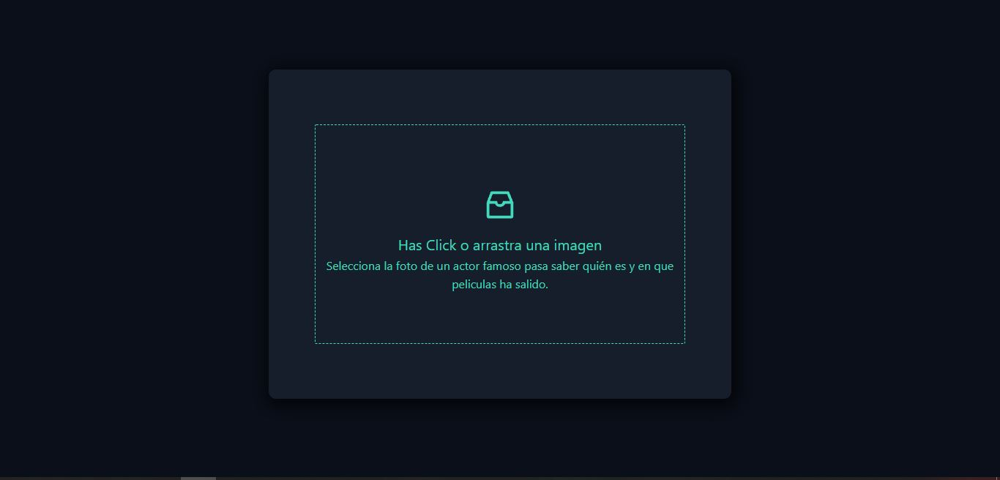
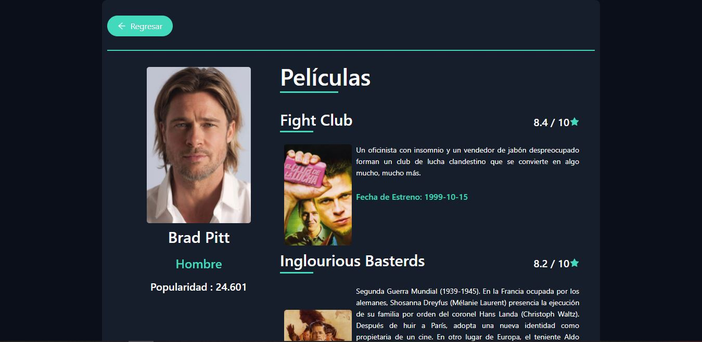

# Looking for the actor 

## Introducción

Se trata de un proyecto donde se utiliza las tecnologias de ReactJS, Redux y Javascript para
el desarrollo de la app, utilizando mas de una API.

## Acerca del Proyecto

Este proyecto consiste en la búsqueda de actores cuando se le carga una imagen(png, jpeg),
donde podrás ver mas de la información del actor(peliculas, rating, popularidad, etc).

## Objetivos del proyecto

- Manejar peticiones a APIs.
- Poder encadenar peticiones. 
- Subir archivos desde el navegador.
- Manejar respuestas JSON.
- Usar herramientas para consulta de APIs como Postman o Paw.

## Lista de tecnologías
### Interfaz:


HTML, CSS, Javascript, React, Ant-design, Redux.

## ** Instrucciones de inicio ** 

## BoilerPlate

Dentro del archivo raiz debes tener que crear un archivo llamado: `.env` 
que tiene la siguiente forma: 

```
REACT_APP_HEADER_KEY=key_de_la_API_Nomada
REACT_APP_API_KEY=key_de_la_API_moviedb
```

Debe reemplazar `key_de_la_API_Nomada`, `key_de_la_API_moviedb` con las key correspondientes .Este archivo será ignorado por github, ya que contiene información confidencial (las credenciales).

## Por consiguiente:
 ### _Instale el paquete necesario para ejecutarlo_

- Abra la consola:
    + Dentro de la carpeta raiz, ejecute la línea de comando,` npm install` / `yarn install`.
### _Ejecutar el proyecto_

- Abra la consola :
    + Dentro de la carpeta raiz, ejecute la línea de comando,` npm start` / `yarn start`.
# Pantallas de proyecto 

- Home 
<p align = "center">  </p>

- Detail 
<p align = "center">  </p>

! [visitantes] (https://visitor-badge.glitch.me/badge?page_id=Hasuro1797.searchActor)
